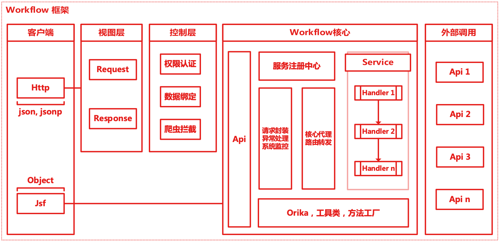

# SpringGear 框架历史演进

SpringGear 框架最早是在 2017 年底重构国内机票 H5 服务端的时候应用的。当时国内机票比较流行使用管道模式，于是作者对管道模式进行深入学习和分析，修改以后形成了更加易于使用的 Workflow 框架。

下图为 Workflow 的核心流程图

Workflow 在设计之初已经有意将整个流程设计为通用流程，但是随着参与项目的人越来越多，需求越来越复杂，在一些功能无法满足的前提下，就逐渐融合了许多非框架层面的内容，例如：监控、异步日志等。

经过两年多的发展，Workflow 逐渐稳定，开发模式也得到了开发人员的认可，于是，在一个新系统的应用中，SpringGear 的抽象雏形破茧而出。

在国内机票进行价格体系重构的时候，有一个新系统由作者负责，作者基于 Workflow，将框架进一步抽象，并起了一个新的名字，意味与 Spring 是伙伴、密不可分的关系，取名为 SpringGear。

由于开发时限，最初 SpringGear 并未独立抽包，所做工作如下：
1. 重新命名，修改包路径，修改日志打印，制定规范
2. 进一步抽象通用方法，抽离业务逻辑代码
3. 重新梳理架构，以动态代理功能为核心，提供 Springmvc，以及集团中间件的快速扩展

接着迎来了第二个新应用，在此新应用有限的时间内，终于对 SpringGear 框架进行独立抽包的工作，直到稳定运行。

同时，将部分前置、后置功能，使用插件形式添加到框架中，使其更加灵活且可控。

最终的工作流程图如下：

目前，SpringGear 仍然有很多不足，作为迭代需要一步一步的进行解决。作者相信 SpringGear 最终可以达到一个可供大家舒服开发的、易上手的 Spring 辅助框架。